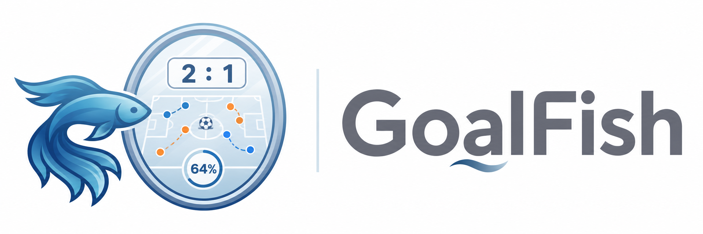
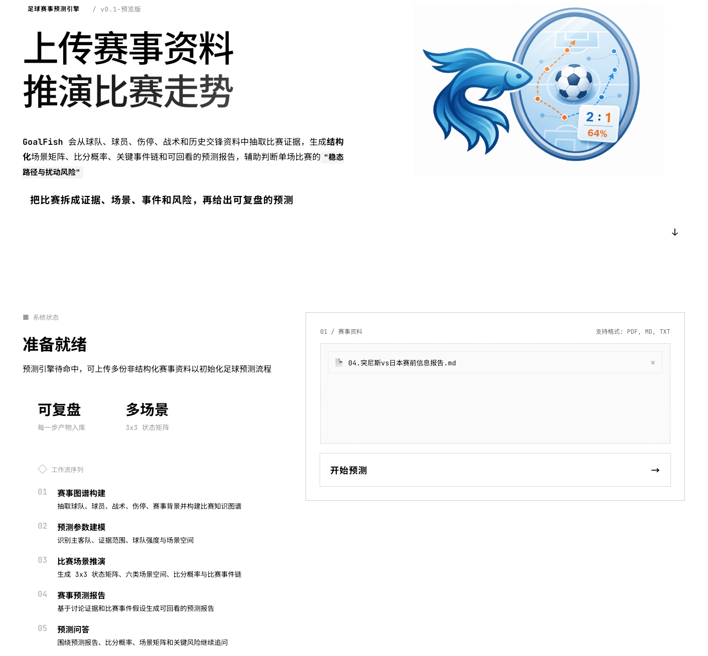
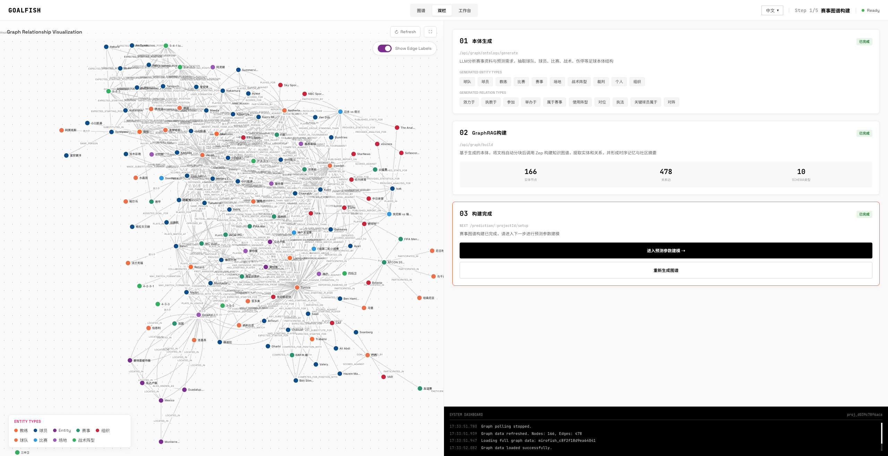
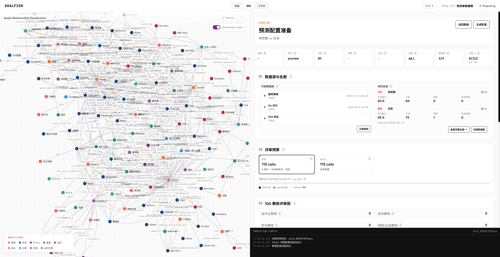
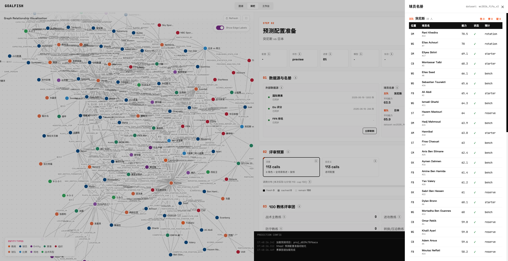
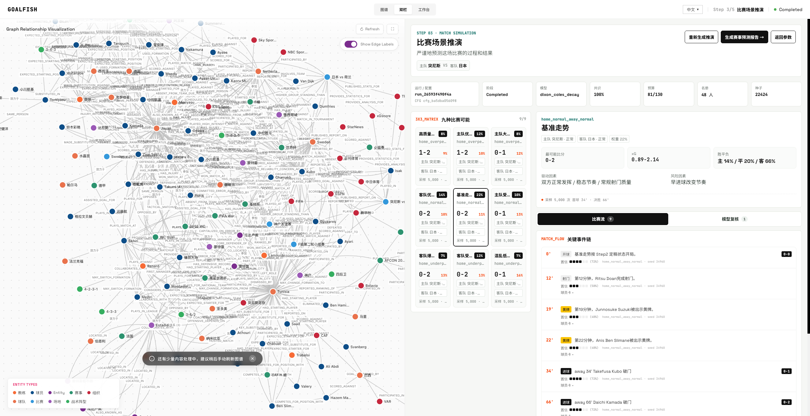
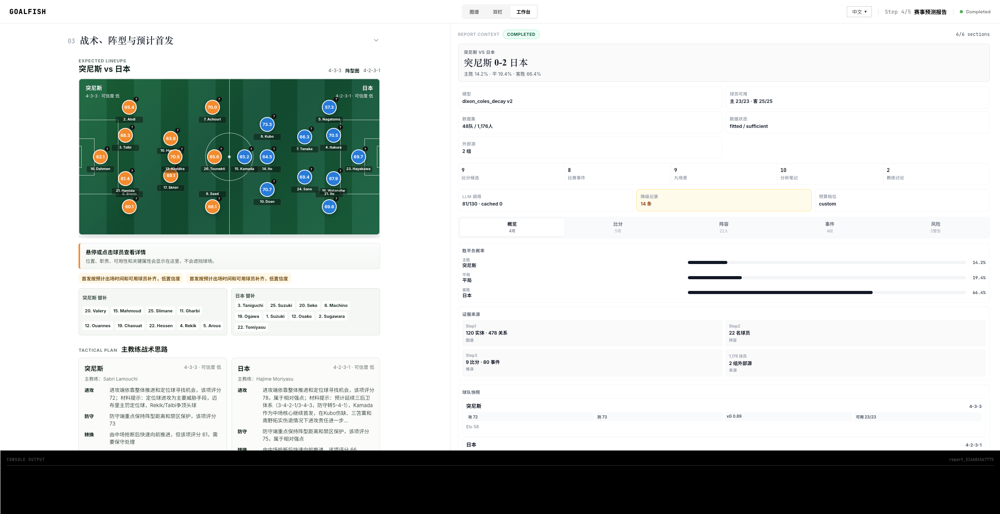
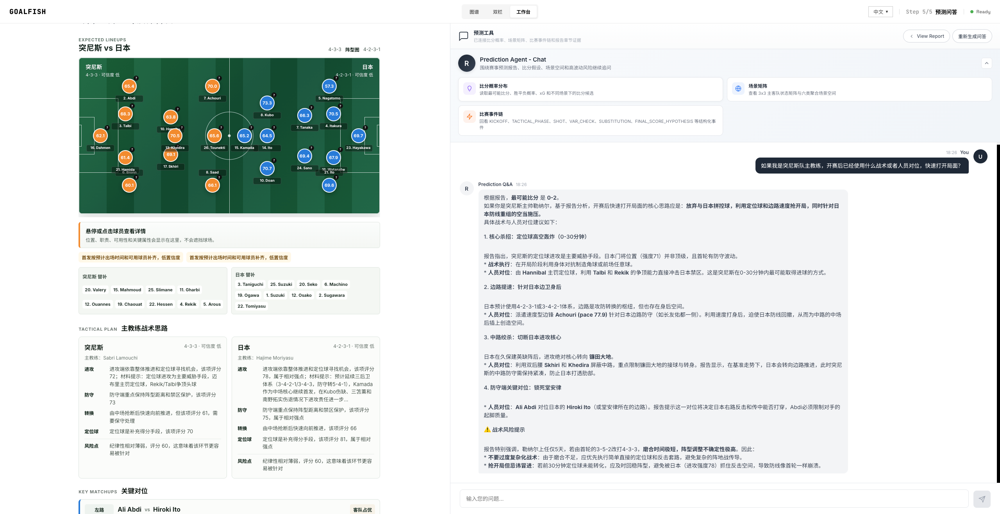
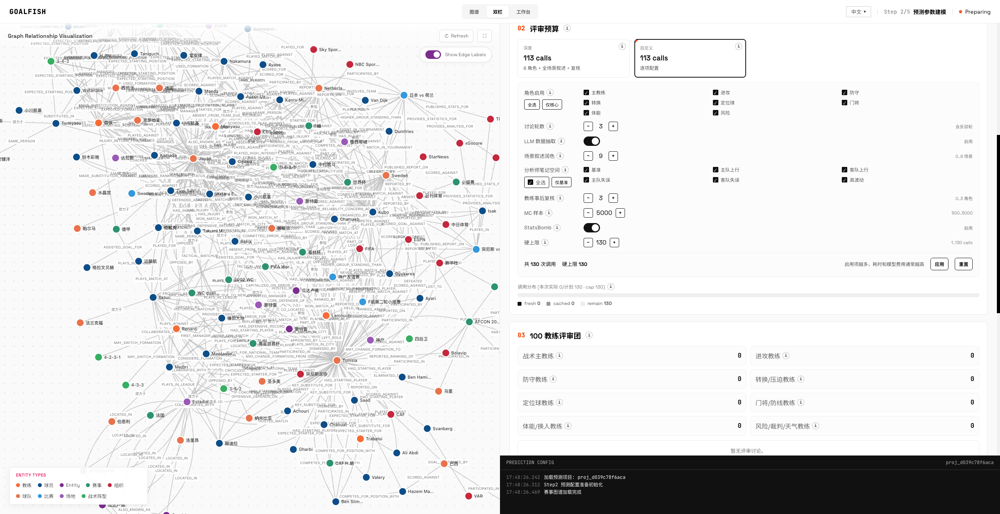
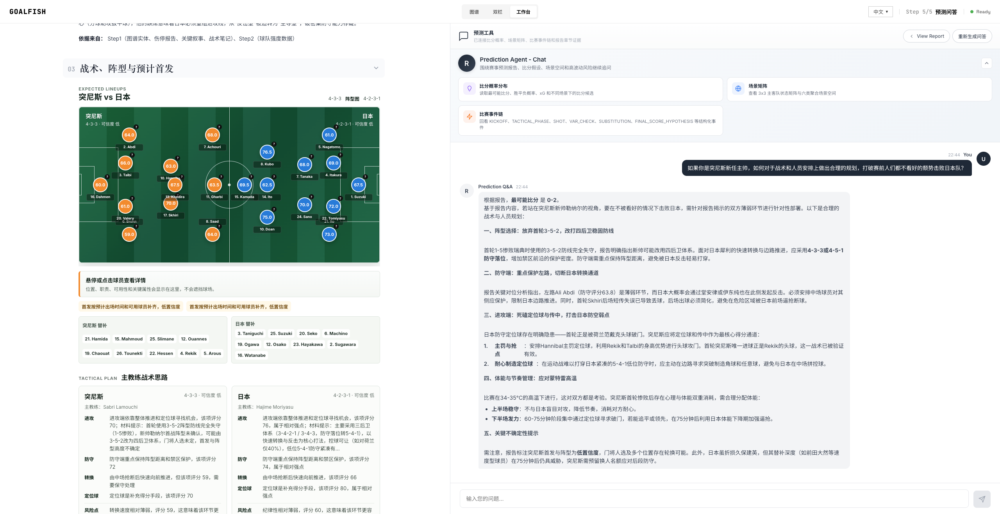

<div align="center">



World Cup Match Prediction: Pre-Match Intelligence, Graph Reasoning, and Scoreline Forecasting Workspace
</br>
<em>A World Cup match forecasting workspace for pre-match intelligence, knowledge-graph reasoning, and scoreline prediction</em>

[中文版本](./README.zh.md)

<p>
  <strong>Static Demo:</strong>
  <a href="https://syloyamtao.github.io/GoalFish/">https://syloyamtao.github.io/GoalFish/</a>
</p>

[](./LICENSE)
[](https://nodejs.org/)
[](https://www.python.org/)
[](https://vuejs.org/)
[](https://www.docker.com/)

</div>

## Overview

**GoalFish** is a World Cup match prediction system derived from the [MiroFish](https://github.com/666ghj/MiroFish) swarm-intelligence workflow and specialized for football pre-match analysis. It turns scouting notes, public match research, team context, and player data into a structured prediction pipeline: upload evidence, build a football knowledge graph, configure match assumptions, run scenario simulation, generate a prediction report, and ask follow-up questions against the generated context.

> Status: this repository is currently a prototype / alpha pre-release. It is usable for local evaluation and iteration, but it is not presented as a final or production-ready release.

The project is designed for World Cup-style forecasting where evidence, squad context, tactical assumptions, and recent team signals all matter. Instead of asking an LLM for a direct guess, GoalFish keeps the workflow explicit:

- **Evidence first**: ingest match research documents and extract football entities, events, relationships, and supporting details.
- **Graph reasoning**: use Graphiti + Neo4j to preserve context as a searchable match knowledge graph.
- **Structured inputs**: combine team metadata, squad data, ranking seeds, player attributes, coach-style reviews, and user scenario assumptions.
- **Simulation and reporting**: run scoreline scenario simulation, then generate a readable match prediction report with traceable reasoning.
- **Interactive review**: continue asking questions after the report is generated, using the same project context.

## Available Scenario

GoalFish is currently packaged around **World Cup match prediction**. The built-in data and sample workflow are optimized for national-team fixtures, especially scenarios such as:

- Forecasting win / draw / loss tendencies before a World Cup match.
- Estimating likely scorelines from team strength, player availability, tactical notes, and match context.
- Turning a pre-match research report into a knowledge graph that can support evidence-based prediction.
- Comparing alternate assumptions, such as lineup changes, injury impact, coach strategy, or form volatility.
- Producing a structured prediction report that can be reviewed and challenged through follow-up Q&A.

**Disclaimer**: GoalFish provides analytical assistance only. Football matches are shaped by uncertainty, chance, emotion, and moments that no model can fully capture. This project is not responsible for any prediction result or for any decision made based on generated reports.

<em>The football gods are watching this World Cup with deep affection. They leave miracles to those with a pure love for the game, turning every cold analysis into nothing more than a magnificent footnote to this grand passion.</em>

## Screenshots

<div align="center">
<table>
<tr>
<td></td>
<td></td>
</tr>
<tr>
<td></td>
<td></td>
</tr>
<tr>
<td></td>
<td></td>
</tr>
<tr>
<td></td>
<td></td>
</tr>
<tr>
<td colspan="2"></td>
</tr>
</table>
</div>

## Workflow

1. **Upload Research**: import a World Cup pre-match report, scouting note, PDF, or text material as the seed evidence for a match project.
2. **Build Match Graph**: extract teams, players, tactical factors, injuries, rankings, form, and contextual relationships into Graphiti / Neo4j.
3. **Configure Prediction**: select teams, adjust match assumptions, review squad data, and inject optional coach or analyst perspectives.
4. **Run Simulation**: combine football goal modeling, scenario weights, graph evidence, and player/team strength estimates.
5. **Generate Report**: produce a structured prediction report with win/draw/loss judgment, likely scorelines, key drivers, and risk factors.
6. **Ask Follow-ups**: chat with the report context to inspect evidence, challenge assumptions, or explore alternate scenarios.

## Quick Start

### Prerequisites

| Tool | Version | Description | Check Installation |
|------|---------|-------------|-------------------|
| **Node.js** | 18+ | Root scripts and Vite frontend runtime | `node -v` |
| **Python** | >=3.11, <3.13 | Flask backend runtime | `python --version` |
| **uv** | Latest | Python dependency and virtual environment manager | `uv --version` |
| **Docker** | Latest | PostgreSQL, Redis, and Neo4j base services | `docker --version` |
| **Ollama** | Latest | Default local chat and embedding model runtime | `ollama --version` |

### 1. Configure Environment Variables

```bash
cp .env.example .env
```

The default configuration uses local Ollama:

```env
LLM_CHAT_PROTOCOL=ollama
LLM_BASE_URL=http://localhost:11434/api/chat
LLM_MODEL_NAME=qwen3.5:2b-mlx

GRAPHITI_EMBEDDING_PROVIDER=ollama
GRAPHITI_OLLAMA_EMBED_URL=http://127.0.0.1:11434/api/embed
GRAPHITI_EMBEDDING_MODEL=qwen3-embedding:0.6b
GRAPHITI_EMBEDDING_DIM=1024
```

If you prefer an OpenAI-compatible online provider, update the `LLM_*` fields in `.env`:

```env
LLM_API_KEY=your_api_key_here
LLM_CHAT_PROTOCOL=openai
LLM_BASE_URL=https://api.deepseek.com/v1
LLM_MODEL_NAME=deepseek-chat
LLM_RESPONSE_FORMAT_JSON_OBJECT_SUPPORTED=true
```

### 2. Start Base Services

```bash
docker compose up -d postgres redis neo4j
```

Service defaults:

- PostgreSQL: `localhost:5432`
- Redis: `localhost:6379`
- Neo4j Browser: `http://localhost:7474`
- Neo4j Bolt: `bolt://localhost:7687`

### 3. Prepare Ollama Models

```bash
ollama serve
ollama pull qwen3-embedding:0.6b
```

Also make sure the model configured by `LLM_MODEL_NAME` exists in `ollama list`.

### 4. Install Dependencies

```bash
npm run setup:all
```

Or install step by step:

```bash
npm run setup
npm run setup:backend
```

### 5. Initialize Database

```bash
cd backend
uv run alembic upgrade head
cd ..
```

### 6. Import Default Player Dataset

```bash
cd backend
uv run python scripts/import_player_dataset.py \
  --input ../data/wc2026_squads_cleaned.csv \
  --team-metadata ../data/wc2026_team_metadata.csv \
  --source-kind fifa_md_2026 \
  --scope fifa_world_cup_2026_squads \
  --dataset-id wc2026_fifa_v2 \
  --normalize-strategy fm
cd ..
```

### 7. Start Celery Worker

Run this in a dedicated terminal:

```bash
cd backend
uv run celery -A app.celery_app.celery_app worker --loglevel=INFO
```

### 8. Start Frontend and Backend

Run this from the project root in another terminal:

```bash
npm run dev
```

Start services individually:

```bash
npm run backend
npm run frontend
```

### 9. Open the Page

Use the Vite terminal output as the source of truth. Usually it is:

```text
http://localhost:3000
```

Backend API:

```text
http://localhost:5001
```

### 10. Demo File

```text
docs/sample/research/20260621/04.突尼斯vs日本赛前信息报告.md
```

## Demo Material

Use the bundled Tunisia vs Japan sample report to try the full workflow:

```text
docs/sample/research/20260621/04.突尼斯vs日本赛前信息报告.md
```

English sample:

```text
docs/sample/research/20260621/04.Tunisia_vs_Japan_Pre-Match_Report_EN.md
```

## Repository Contents

```text
backend/                         Flask API, Celery tasks, Graphiti integration, football prediction services
frontend/                        Vue 3 + Vite application
data/wc2026_squads_cleaned.csv   Default World Cup squad/player dataset
data/wc2026_team_metadata.csv    Team metadata used by the roster importer
data/holdout/                    Backtest / holdout data
docs/sample/research/            Example pre-match research documents
static/                          README screenshots
```

## Useful Commands

```bash
# Install all dependencies
npm run setup:all

# Start frontend and backend together
npm run dev

# Start backend only
npm run backend

# Start frontend only
npm run frontend

# Run backend tests
cd backend && uv run pytest

# Run frontend tests
cd frontend && npm test

# Build frontend
cd frontend && npm run build
```

## Notes

- PostgreSQL, Redis, and Neo4j are required for the full workflow.
- `docker-compose.yml` currently starts infrastructure services only; the frontend and backend are run from source.
- GoalFish's graph memory layer uses **Graphiti** with **Neo4j**, and the application keeps compatibility with local Ollama and OpenAI-compatible LLM providers. **Celery** acts as the background workflow executor for long-running jobs such as match knowledge-graph construction and prediction report generation, providing queueing, persistent job status, retry handling, and frontend-visible progress updates.
- Graph building defaults to Celery with Redis. Keep the Celery worker running while building the knowledge graph.
- If local Ollama is not running, or if either the chat model or embedding model is missing, graph and report steps that depend on LLM calls will fail.
- Backend console output is mirrored to `logs/<startup-time>.log` for debugging.

## Acknowledgments

GoalFish is derived from the [MiroFish](https://github.com/666ghj/MiroFish) project structure and adapts its multi-agent prediction workflow to football pre-match intelligence and score forecasting.

## License

AGPL-3.0
